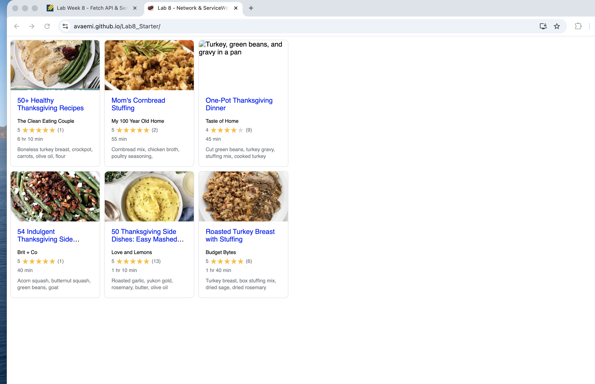

# Lab 8 - Fetch API & Service Workers

## Team
* Ava Emami

## Deployed GitHub Pages URL
https://avaemi.github.io/Lab8_Starter/

## Graceful Degradation & Service Workers
Graceful degradation is the idea that an app should still work at a basic level even when something goes wrong, like losing internet connection. Service workers support this by caching the app's resources in the browser. The first time you load the page, the service worker saves the HTML, CSS, JS, and recipe data locally. If you go offline and reload, the service worker serves those cached files instead of failing. This means the app still loads and displays recipes even without a network connection, which is a good example of graceful degradation in practice.

## PWA Screenshot
